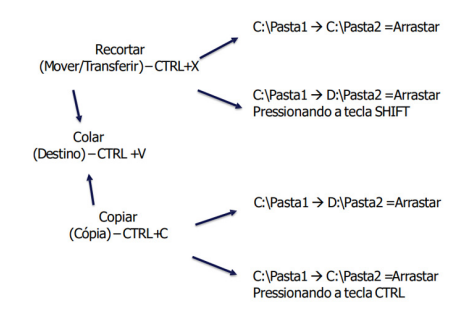
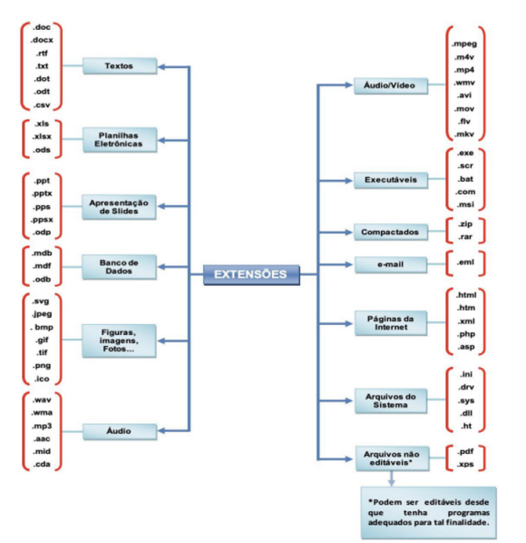

# Organização e Gerenciamento de Informações

 

## DEFINIÇÃO
* Se trata de entender o funcionamento dos recursos de organização, gerencia e manipulação de arquivos nos sistemas operacionais.

> ### Funcionamento do mouse
* Possui três botões:
  - Botão esquerdo (botão de ação);
  - Scroll (botão de navegação);
  - Botão direito (botão de opções).

> ### Arquivos
* Arquivos são onde se organizam os dados e informações.
* O metadados são dados sobre o arquivo. É possível acessá-los na opção **propriedades** dos arquivos.

> ### Explorador de arquivos
* É o programa que gerencia os arquivos e pastas no computador. No windows o explorador é o **windows explorer**.

#### Acesso rápido
* Contém o acesso a pastas favoritas. É possível fixar pastas e ter acesso as pastas mais utilizadas.

#### One drive
* O serviço de armazenamento em nuvem da microsoft é integrado ao windows explorer, possibilitando integrar de diferentes formas arquivos locais e remotos.
* Status dos arquivos:
  - Ícone de escala verde (arquivo online);
  - Ícone verde (arquivo online e local);

#### Guia layout
* Guia que gerencia a exibição dos arquivos.
* Opções:
  - Ícones pequenos;
  - Ícones médios;
  - Ícones grandes;
  - Ícones extragrandes; 
  - Blocos;
  - Lista (arquivos em lista);
  - Conteúdo;
  - Detalhes (arquivos em lista com seus metadados).

#### Guia arquivo
* Fornece as opções:
  - Abrir nova guia;
  - Alterar opções de pasta e pesquisa;
  - Locais frequentes.

#### Guia compartilhar
* Principal destaque é para opção de compactar arquivos e pastas com a tecnologia **zip**.

#### Bibliotecas
* As bibliotecas são indexadores dos arquivos, que estão armazenados em diferentes pastas do disco.
* Elas organizam os arquivos por tipo para facilitar o acesso.

> ### Manipulação de arquivos
* A manipulação de arquivos consiste em recortar, mover, copiar e criar um atalho de arquivos.
* O comportamento das opções variam de acordo com a origem do arquivo e seu destino.
* Atalhos são acessos aos arquivos, os apagar não apaga o arquivo.
* Comando de criar atalho:
  - ALT + CTRL + SHIFT
 

    

          

> ### Nomes de arquivos e pastas
* O windows não diferencia minúscula de maiúscula.
* Caracteres não permitidos em nomes:
  - \/|:*?'<>
* Nomes reservados:
  - CON, PRN, AUX, NUL, COM0, COM1, COM2, COM3, COM4, COM5, COM6, COM7, COM8, COM9, LPT0, LPT1, LPT2, LPT3, LPT4, LPT5, LPT6, LPT7, LPT8 e LPT9.

> ### Extensões dos arquivos

 

    

                         

***DICA:*** Mp3 é áudio comprimido, WAV é aúdio com qualidade original.

> ### Teclas de atalho

| TECLA              | FUNÇÃO                       |
| ------------------ | ---------------------------- |
| CTRL + A           | Selecionar tudo              |
| F2                 | Renomear                     |
| SHIFT + DELETE     | Excluir permanentemente      |
| WIN + E            | Abrir explorador de arquivos |
| ALT + ENTER        | Propriedades                 |
| SELECIONAR + CTRL  | Seleção aleatória            |
| CTRL + SHIFT + N   | Criar pasta                  |
| DELETE             | Enviar para a lixeira        |
| SELECIONAR + SHIFT | Seleção contínua             |