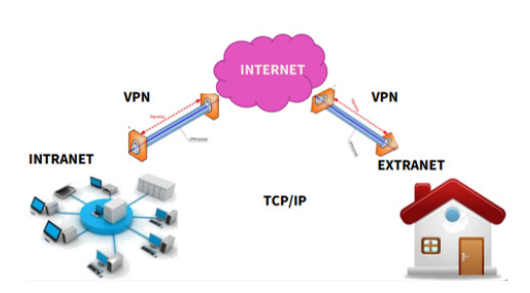
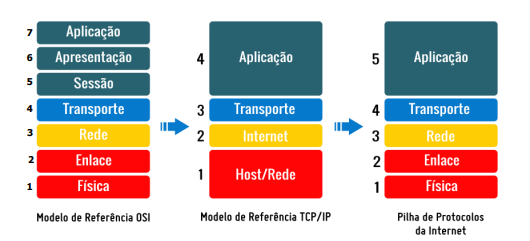
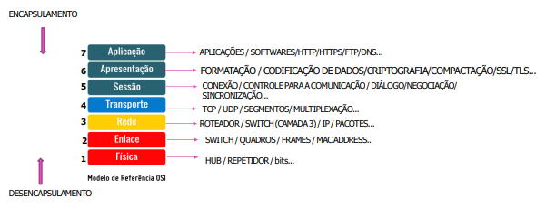
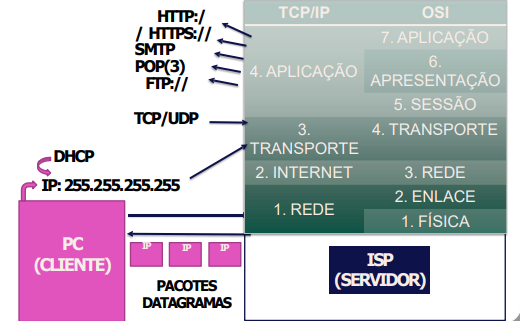

# Redes de Computadores

 

## INTERNET
* É a rede mundial de comunicação entre computadores, formada por milhares de redes telefônicas e informáticas que forcecem produtos e serviços.
* As grandes conexões de transferência de alta velocidade e alta capacidade que conectam os continentes são chamados de **backbone**.

## INTRANET
* É uma rede privada, ao passo que a internet é uma rede pública. 
* Por exemplo a intranet é um sistema criado geralmente na rede da empresa, dentro da circunscrição dela, o que não significa dizer que a empresa só poderá ter uma intranet, pois podem existir filiais e várias empresas reunidas (filiais e matriz). Desse modo, esse sistema é acessado somente por pessoas devidamente autorizadas, que são os funcionários, os colaboradores ou os servidores do órgão, mediante a utilização de login e senha. 
* A intranet é um sistema fechado em que somente pessoas  autorizadas acessam.
* A intranet trabalha com os mesmos programas e protocolos da família TCP/IP, não havendo diferença.
* Assim, quando se acessa uma intranet fora da empresa, é interessante mencionar que se utilizará a internet como meio de acesso e, como a internet é pública, dados poderão ser interceptados e roubados. Contudo, para que isso não aconteça, há a possibilidade de configuração, entre o acesso do funcionário e o servidor, de um túnel virtual, chamado VPN (virtual private network). Trata-se de uma rede privada virtual em que se cria um tunelamento onde os dados trafegarão entre a máquina do funcionário e o servidor da intranet, normalmente utilizando criptografia na transmissão dos dados e IPSec (IP mascarado e “oculto” na internet).

## EXTRANET
* Trata-se de separar parte da intranet e dedicar para fornecedores, parceiros comerciais e clientes. Então, a extranet é uma parte da intranet quando permite o acesso a
esse grupo de pessoas. 
* Por exemplo, acessar o internet banking para gerar fatura de cartão de crédito é um exemplo de extranet, pois se acessa a intranet do banco dedicada para clientes. Assim, o que muda de uma para outra é aquele que acessa.

 

    

           

## SERVIÇOS PRESENTES NA INTERNET

> ### Wiki
* Página web formada pela colaboração das pessoas e aberta a alteração por qualquer usuário, em que as mudanças são validadas por moderadores.

> ### Motor de busca
* É o software responsável por encontrar informações armazenadas a partir de palavras chave. O resultado das buscas é indexado a partir do navegador utilizado.
* O Buscador chamado de  Aranha da web (Spider, crawler, robô, bot) coleta as informações e é indexado pelo navegador (google, bing, etc).

#### Filtros do google

| FILTRO  | AÇÃO                                  | Exemplo                     |
| ------- | ------------------------------------- | --------------------------- |
| ""      | Pesquisa exata                        | "melhor carro"              |
| -       | Excluir da busca                      | velocidade do jaguar -carro |
| OR      | Resultados com as duas palavras chave | carro OR moto               |
| Inurl   | Páginas que contenham palavras da URL |                             |
| Related | Páginas do mesmo assunto              |                             |
| Link    | Páginas que fazem referência          |                             |
| ..      | Intervalo                             |                             |
| Site:   | Páginas do portal                     | site:google.com             |
| #       | Redes sociais                         | #nome                       | 
| @       | Twitter                               | @twitter palavra            |
| $       | Pesquisa de preços                    | celular $1000               | 
| *       | Termos desconhecidos                  | como criar * em python      |

## PROTOCOLOS DA INTERNET
* Conjunto de regras e convenções padronizadas paa troca de dados entre computadores ligados em rede.
* O principal modelo de protocolos utilizado é o TCP/IP que tem como referência o modelo OSI.

 

    

           

 

    

           

 

    

                 

> ### Protocolo TCP
* O TCP (transmission control protocol), protocolo orientado para a conexão, possibilita a transferência de dados na internet, com as características de confiabilidade, isto é, a mensagem chega ao receptor ou mensagens enviadas chegam na ordem de envio. O TCP é o protocolo responsável em transportar os pacotes de dados da rede. Utilizado em transporte de pacotes que exigem confiabilidade. 
* São Exemplos: E-mail, transferência de sites, etc.

> ### Protocolo UDP
* O UDP (User Datagram Protocol), um protocolo não orientado para a conexão, possibilita a transferência de dados na internet, com as características de não confiabilidade, isto é, a mensagem pode não chegar ao receptor ou mensagens enviadas podem chegar fora da ordem de envio. Utilizado em transporte de pacotes que exigem velocidade e não confiabilidade.
* São Exemplos: Chamadas ao vivo etc.

> ### Protocolo IP
* O TCP e o Internet Protocol (IP - Protocolo de Internet), são os dois protocolos mais importantes da internet. Em suma, o protocolo IP especifica o formato dos pacotes que são enviados e recebidos entre roteadores e sistemas finais. 
* Endereço de Protocolo da Internet (Endereço IP/IP address), é um número atribuído a cada dispositivo (computador, impressora, smartphone etc.) conectado a uma rede de computadores que utiliza o Protocolo de Internet para comunicação. O IP não estabelece uma conexão para envio dos pacotes, nem garante um serviço confiável de envio de mensagens com retransmissão em caso de perda. Sendo assim, toda vez que se conecta a uma rede, ganha-se um número de identificação, chamado de IP.

> ### Protocolo NAT
* NAT (network address translation) é um protocolo que faz a tradução dos endereços Ip e portas TCP da rede local para a Internet. 
* Por exemplo, o pacote a ser enviado ou recebido de sua estação de trabalho na sua rede local, vai até o servidor onde seu ip é trocado pelo ip do servidor a substituição do ip da rede local valida o envio do pacote na internet, no retorno do pacote acontece a mesma coisa, porém ao contrário o que garante que o pacote chegue ao seu destino.
* Quando as máquinas na rede local mandam os pacotes para o roteador, o protocolo chamado NAT, pegará os pacotes e converterá o IP dessas máquinas para o do roteador e mandará
para a internet, quando devolver, faz o contrário (reconverte o IP do roteador para o IP local).

> ### Protocolo ARP
* ARP pega o IP e associa ao MAC ADRESS. Ele tem um papel fundamental entre os protocolos da camada Internet da suíte TCP/IP, porque permite conhecer o endereço físico de uma placa de rede que corresponde a um endereço IP. 

> ### Protocolo RARP 
* Faz o contrário do ARP, pois pega o MAC (endereço físico) e associa ao lógico (IP).
* Cada máquina ligada à rede possui um número de identificação de 48 bits. Este número é um número único, fixado a partir da fabricação da placa de rede na fábrica. Entretanto, a
comunicação na Internet não é feita diretamente a partir deste número (porque seria necessário alterar o endereçamento dos computadores cada vez que se alterasse uma placa de
rede), mas a partir de um endereço dito lógico, atribuído por um organismo, o endereço IP.
* Assim, para fazer a correspondência entre os endereços físicos e os endereços lógicos, o protocolo ARP pergunta às máquinas da rede para conhecer o seu endereço físico e depois cria uma tabela de correspondência entre os endereços lógicos e os endereços físicos numa memória.

> ### Protocolo DHCP
* Dynamic Host Configuration Protocol é um protocolo de serviço TCP/IP que oferece configuração dinâmica de terminais, com concessão de endereços IP de host e outros parâmetros de configuração para clientes de rede.
* Ao colocar o dispositivo no modo avião, perdem-se as conexões de rede. Quando sai do modo avião, o telefone procura o sinal da operadora, encontra, conecta por intermédio do chip, realiza a autenticação e o protocolo da operadora gera o IP, desse modo, só se pode acessar a rede, pois o protocolo gerou o IP para se conectar a ela.

> ### Protocolo DNS
* Cada domínio possui um registro no DNS que define qual o endereço IP do servidor de hospedagem e o IP do servidor de e-mail que responderão por este domínio. 
* O processo para a descoberta dos servidores que respondem por um domínio é denominado resolução do nome ou resolução do domínio. 
Sendo assim, todo endereço que se digita um nome, é um número (Ip, o computador só entende endereços numéricos), desse modo, para não ter que memorizar milhares de sites acessados, assim que se digita o endereço e aperta enter, o nome irá para um DNS, que irá usar esse nome e procurar pelo IP em uma tabela, se existir, a página retornará para o usuário; se for digitado errado, não achará o IP e haverá o erro 404.

> ### Protocolo HTTP
* HyperText Transfer Protocol (Protocolo de transferência de Hipertexto) é o conjunto de regras que permite a transferência de informações na Web. Responsável pelo acesso as páginas da WWW via navegador.
* O HTTP não é seguro, trabalha com texto cru, é de fácil de interceptação e leitura de dados de terceiros na rede. 

> ### Protocolo HTTPS 
* HyperText Transfer Protocol secure, é uma implementação do protocolo HTTP sobre uma camada SSL ou do TLS, essa camada adicional permite que os dados sejam transmitidos através de uma conexão criptografada e que se verifique a autenticidade do servidor e do cliente através de certificados digitais.
* Ao se conectar a um navegador, por exemplo, é aberta uma porta entre o usuário e servidor acessado, que são numeradas, os protocolos atuam em portas fixas, como o HTTP (porta 80, por norma), HTTPS (porta 443), DNS e protocolos de e-mails também têm suas portas.

> ### Protocolo FTP 
* File Transfer Protocol (Protocolo de Transferência de Arquivos), é uma forma bastante rápida e versátil de transferir arquivos (também conhecidos como ficheiros), sendo uma das mais usadas na internet. 

> ### Protocolo SMTP 
* Simple Mail Transfer Protocol é o protocolo padrão para envio de e-mails através da Internet. 

> ### Protocolo POP 
* Post Office Protocol (POP3) é um protocolo utilizado no acesso remoto a uma caixa de correio eletrônico. O POP3 está permite que todas as mensagens contidas numa caixa
de correio eletrônico possam ser transferidas sequencialmente para um computador local.
* Esse é um protocolo antigo. O servidor fica sem os e-mails, se precisar acessar de outro computador, não será possível.

> ### Protocolo IMAP 
* Internet Message Access Protocol é um protocolo de gerenciamento de correio eletrônico que as mensagens ficam armazenadas no servidor e o internauta pode ter acesso a suas pastas e mensagens em qualquer computador, tanto por webmail como por cliente de correio eletrônico.
É o protocolo mais usado. As mensagens ficam sincronizadas no servidor e na máquina, assim, ao ir em outro computador, será possível ter acesso aos e-mails.

## MEIOS DE TRANSMISSÃO
* Os meios de transmissão se dividem em: guiado (com fio) e não guiado (sem fio).

> ### Meios guiados

#### Cabo coaxial (BNC)
* Foi um dos primeiros tipos de cabos usados em rede que, atualmente, não é mais utilizado. 
* Destaca-se que é muito utilizado para as antenas de TV’s. 
* Possui velocidade média de 10Mbps mas, com uma tecnologia chamada Docsis 3.1, poderá chegar a velocidades superiores a 10, por exemplo, a 100, a depender da tecnologia. Tem como padrão (tipo de cabo) o 10base2, cabo fino chamado thinnet (185 Mts) e 10base5, chamado thicknet, modelo mais grosso, podendo atingir até 500mts, sem repetidor. E, na ponta desse cabo, há um conector de rosca (roda e encaixa), chamado de BNC. Então, para as redes, esse cabo está ultrapassado.

#### Cabo par trançado (UTP/STP)
* Trata-se do cabo mais utilizado, hoje, em redes locais. Geralmente possui cor azul (por fora) ou amarela e é composto por vários fios que fazem pares entrelaçados.
* Destaca-se que esses fios entrelaçados são conectados no conector RJ-45 e depois ligados à placa de rede. Atenção para não confundir o conector RJ-45 com o conector do telefone que é o RJ-11. Isso porque o telefone fixo usava apenas dois fios, um par de fios, mas o RJ-45 não são dois, é uma quantidade maior para trabalhar com dados.
Esse cabo tem dois tipos: UTP e STP. O primeiro deles não é blindado, possui os fios e logo depois a malha de borracha. Destaca-se que não é muito recomendável para passar em indústrias e empresas por interferências eletromagnéticas. Ou seja, não se pode trabalhar com cabo de dados perto de energia elétrica, pois atrapalhará a transmissão.
* Por outro lado, o cabo STP possui uma blindagem de alumínio (há os fios, uma blindagem de alumínio e depois a blindagem de borracha do acabamento por fora). Trata-se de cabo um pouco melhor e mais caro no mercado. Dessa forma, em lugares que há transmissão de energia por perto ou em indústrias, por exemplo, utiliza-se muito o STP.
* Os padrões desse cabo, além de UTP e STP, são: Ethernet (802.3), que alcança velocidades de 10 Mbps, 100 Mbps no Fast Ethernet ou 1000 Mbps no Giga Ethernet. Por exemplo, se há uma internet de 200, 300, 400 mega, é necessário ter uma placa de rede com essa tecnologia, obviamente, se for a cabo. Ademais, o padrão é o 10, 100 ou 1000baseT (t refere-se a trançado) que tem a ver com a velocidade. Tem categorias que vão da 1 até a 8 e são as categorias da evolução do cabo e alcança uma distância de até 100 metros sem necessidade de repetidor.
* Para as redes locais, é o mais utilizado e cotado.

#### Fibra óptica
* Trata-se do auge da tecnologia do cabeamento que não utiliza o cobre o que, por exemplo, permite que não haja interferência eletromagnética na fibra óptica porque ela
opera com luz, laser ou led. São cabos extremamente finos, um pouco mais grossos que um fio de cabelo, que farão a transmissão via luz.
* Por praticamente não haver interferência eletromagnética, a velocidade é incomparável, pois trata-se de uma alta tecnologia. Contudo, ainda é custosa porque não é qualquer empresa que irá investir na sua rede com fibra óptica.
* A fibra óptica tem uma quantidade maior de conectores. O FDDI é muito comum e possui fibra dupla para que se faça o anel duplo. Há também o LC que é muito comum nas empresas de fibra óptica como a VIVO FIBRA. Ainda, o SC também é muito utilizado.
*  No modelo de fibra óptica Multimodo existem vários feixes de luz que transitarão no cabo. Destaca-se que essa fibra é indicada para redes locais, pois faz uma emissão por meio de led a uma distância de até 2 km, com velocidade na ordem de 10Gbps e é mais barato e flexível. 
* O modelo Monomodo tem apenas um feixe de luz, sendo indicado para redes de longa distância, redes WANs (backbones da internet onde os cabos são passados pelo oceano e pelo planeta). A
emissão é feita por laser, podendo alcançar distâncias de mais de 100km, sem repetidor, e velocidade na ordem de 100Gbps. O núcleo é reduzido, ou seja, gera-se apenas um feixe de luz.

> ### Meios não guiados

#### Nfc-IEEE 802.20
* Trata-se de comunicação por campo de proximidade (CCP), ou near-field communication (NFC), é uma tecnologia que permite a troca de informações sem fio e de forma segura entre dispositivos compatíveis que estejam próximos um do outro. Ou seja, logo que os dispositivos estejam suficientemente próximos, a comunicação é estabelecida automaticamente, sem a necessidade de configurações adicionais. 
* Estes dispositivos podem ser telefones celulares, tablets, crachás, cartões de bilhetes eletrônicos, pulseiras e qualquer outro dispositivo que tenha um chip NFC.
* Trata-se de tecnologia de curtíssima distância, sendo aquela que utiliza a aproximação para, por exemplo, pagar com cartão de crédito ou aproximar crachá a um sensor. 
* É uma tecnologia muito utilizada atualmente, principalmente nos smartphones. Ainda, essa mesma tecnologia é utilizada para ligar carros também através de sensores.

#### Bluetooth - IEEE 802.15
* Trata-se de outra tecnologia wireless, sem fio, de curta distância, econômica, pois gasta pouca energia, muito utilizada para realizar transferência de dados entre, por exemplo, fone de ouvido com smartphone, smartphone com som de carro, smartphone com a caixa de som da Alexa etc.
* Opera com até 8 dispositivos, sendo possível fazer uma rede chamada de rede piconet. Para isso, uma combinação de hardware e software é utilizada para permitir que essa comunicação ocorra entre os mais diferentes tipos de aparelhos. A transmissão de dados é feita através de radiofrequência, permitindo que um dispositivo detecte o outro independente de suas posições, desde que estejam dentro do limite de proximidade.

#### Wifi – IEEE 802.11
* A Wi-Fi utilizada em casa através dos roteadores de internet, sem utilização de fio, atualmente muito popular, pois praticamente toda conexão contratada utiliza o roteador, sem fio, para realizar a transmissão dos dados.