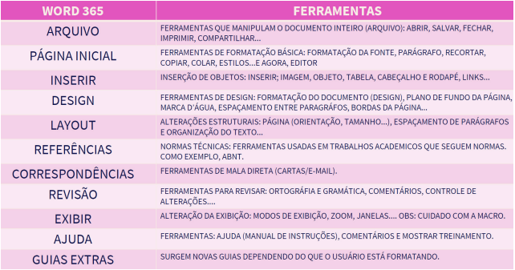
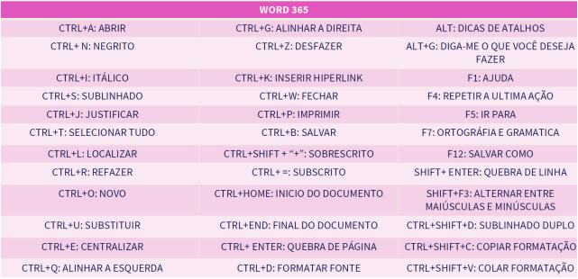

# Word

 

## DEFINIÇÃO
* Editor de texto da microsoft.

#### Características
* Formatos: .XML, .DOCX, .DOC, .DOCM, .DOT, DOTX, .ODT, .RTF, .XML, .HTML, .PDF.
* Exporta e edita pdf.
* É um software proprietário.
* É pago.

> ### Guia arquivo
* Contém opções relacionadas ao documento como um todo. 
* A guia arquivo oferece opções como salvar, abrir, imprimir, compartilhar e exportar, além de funcionalidades de backup e recuperação de dados.

> ### Guia página inicial
* Concentra nas ferramentas básicas, aquelas que são frequentemente utilizadas no dia a dia, sendo a primeira guia que aparece quando o Word é aberto. 
* Essa guia oferece as ferramentas que serão utilizadas com frequência, como recortar, copiar e colar, além de opções de formatação de texto, como tipo de fonte, tamanho e negrito. Essas funções são essenciais para a edição de documentos. 

> ### Guia inserir
* Encontram-se ferramentas voltadas para a importação de elementos externos para dentro do texto. Por exemplo, é possível inserir novas páginas, tabelas, imagens, smartart, gráficos, vídeos do YouTube, links, comentários, cabeçalhos e rodapés, e caixas de texto. 
* Essa guia é essencialmente dedicada a trazer conteúdo de fora para dentro do documento.

> ### Guia desenhar
* É uma adição recente, oferecendo recursos para desenho à mão livre no Word, utilizando canetas digitais ou o mouse. 
* Além disso, essa guia inclui ferramentas para reconhecimento de expressões matemáticas, como a conversão de desenhos de raiz quadrada em fórmulas matemáticas.

> ### Guia design
* É focada em aspectos estéticos do texto, como cor, fonte e layout, aplicáveis a todo o documento. 
* Essa guia é essencialmente voltada para a estética global do texto. Pode-se alterar a estética de algumas palavras, frases ou linhas do texto todo. 
* No entanto, na guia design, essa alteração se aplica ao documento como um todo, independentemente da quantidade de linhas. Por exemplo, ao alterar um tema ou adicionar uma marca d’água, a estética do documento inteiro é modificada, ocorrendo a mesma coisa ao aplicar bordas nas páginas.

> ### Guia layout
* As alterações se referem à estrutura e organização do texto completo. Ao ajustar margens, orientação da página, tamanho do papel, número de colunas e outros recursos de formatação de parágrafos, a estrutura do documento todo é afetada. 
* É possível, por exemplo, utilizar quebras de seção para aplicar formatação diferente em partes específicas do documento.

> ### Guia referências
* Na guia referências, encontram-se ferramentas destinadas à formatação de trabalhos que seguem normas técnicas, como monografias e TCCs.

> ### Guia Correspondências
* É utilizada principalmente para criar mala direta. Este recurso permite personalizar documentos para diversos destinatários, como cartas, etiquetas ou e-mails, a partir de uma lista de contatos. 
* Para realizar a mala direta, é necessário trabalhar com a guia correspondências e seus recursos de mesclagem. 

> ### Guia revisão
* A guia de Revisão é onde estão localizadas as ferramentas destinadas a revisar e
aprimorar um texto. Por meio dessas ferramentas, é possível corrigir erros ortográficos
e gramaticais, bem como melhorar a estrutura e concisão do texto. No Editor, disponível
também na guia Página Inicial, são oferecidas análises mais detalhadas, incluindo verificação de plágio e sugestões de sinônimos para enriquecer o vocabulário. Além disso,
o Editor auxilia na contagem de palavras e na garantia da acessibilidade do texto, por
exemplo, através da leitura em voz alta para facilitar a compreensão.
Outras funcionalidades presentes na guia Página Inicial incluem o Dicionário de Sinônimos, que ajuda a evitar redundâncias no texto, e a ferramenta de contagem de palavras. A acessibilidade é promovida com recursos como o leitor de tela para usuários com
dificuldades visuais. Além disso, é possível trabalhar com diferentes idiomas, incluindo
tradução de textos. Comentários também são uma ferramenta importante para revisão,
permitindo que se façam observações e sugestões diretamente no texto.
O Controle de Alterações é uma funcionalidade frequentemente utilizada em colaborações, especialmente quando documentos são compartilhados no OneDrive. Ao compartilhar um documento, este é armazenado no OneDrive, permitindo o controle das
alterações realizadas por diferentes colaboradores ao longo do tempo, sendo possível
enviar convites para outras pessoas colaborarem no documento. Se essas pessoas possuírem autorização de edição, elas poderão fazer modificações no documento. 
Ao ativar a ferramenta de Controle de Alterações, todas as edições feitas pelas pessoas são registradas. Um painel ao lado esquerdo mostra quem fez as alterações, juntamente com o horário e a data. No próprio texto, as alterações são identificadas: uma
palavra em vermelho e com um traço indica que foi removida, enquanto uma palavra em
vermelho e sublinhada indica uma adição. Dessa forma, pode-se gerenciar essas alterações conforme necessário.

> ### Guia exibir
A lógica por trás dessa guia é simples: se algo está sendo exibido, pressupõe-se que
pode ser ocultado, e o que foi ocultado pode ser exibido novamente. Essa guia trata da
manipulação da visibilidade de elementos, geralmente relacionados às próprias ferramentas do programa.
Essa guia possui as macros que são ferramentas de automação no Microsoft Office,
permitindo gravar e executar comandos em documentos. Embora úteis, sua inclusão na
guia em questão parece fora de contexto.

> ### Resumo

 

    

               

 

    

           